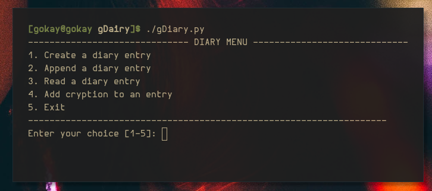

# gDiary

## Why?

- You like CLI tools to keep a diary
- You like to keep your thoughts to yourself
- You like to make your diary little bit harder to be read by other people

## What you will need
- Python 3

## How to use

- Make sure you have Python 3
- Use your terminal and clone this repo
- "git clone https://github.com/gokaybalci/gDiary.git"
- Get into the folder
- "cd gDiary"
-Launch the program
- "./gDiary.py"

After opening the program, you will be welcomed with a menu containing different items.
Menu is self-explanatory.

