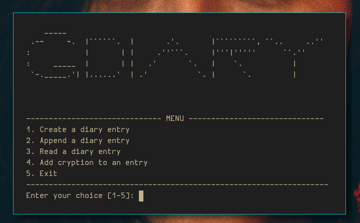

<h1>gDiary</h1> 

<ul>

</ul>

<h1>Why?</h1>
<ul>
<li>You like CLI tools to keep a diary</li>
<li>You like to keep your thoughts to yourself</li>
<li>You like to make your diary little bit harder to be read by other people </li>
</ul>

<h1>What you will need</h1>
<ul>
<li>Python 3</li>
</ul>

<h2>How to use</h2>
<ul>
<li> Make sure you have Python 3
<li> Use your terminal and clone this repo
`git clone https://github.com/gokaybalci/gDiary.git`
<li> Get into the folder
`cd gDiary`
<li> Launch the program
`./gDiary.py`

After opening the program, you will be welcomed with a menu containing different items.
Menu is self-explanatory.
</ul>
</ul>

